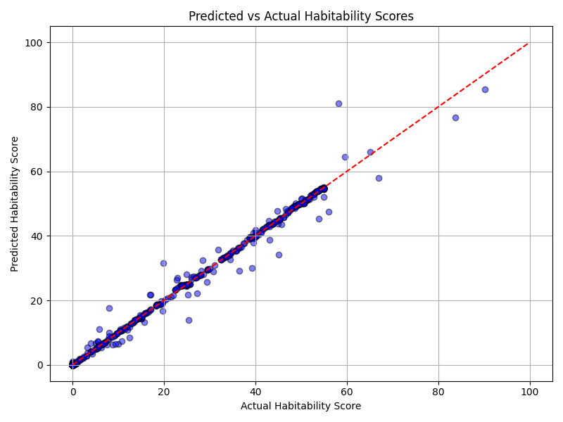

# Predicting Exoplanet Habitability with ML

Locating habitable exoplanets is key in finding extraterrestrial life.

This project uses **NASA Exoplanet Archive** data for determining habitability.

Roughly 4000 planets were used from the Planetary Systems Composite Data (~6000 planets).

## Process:

### 1. Data Cleaning

- Data was first cleaned to exclude outliers and physical anomalies.

### 2. Visualization

- Graphs were made using matplotlib to visualize the distribution of planet's features for further cleaning.

### 3. Scoring

- Exoplanets were then scored based on several factors, including:

    * *Equilibrium Temperature (K)*: Planets can't be too hot or too cold. Must be in habitable zone.

    * *Radius (Earth Radii)*: Small planets are likely to not hold an atmosphere. Large planets may be gaseous.

    * *Mass (Earth Mass)*: Planets too massive may have too high of gravity. Smaller, vice versa.

    * *Density (g/cm^3)*: Less dense planets are gaseous.

    * *Insolation Flux (Earth Flux)*: Energy is needed for liquid water.

### 4. Machine Learning Prediction

- A Random Forest model was trained on actual scores and predicted new scores (80 train / 20 test).

    * An R^2 score of 0.99 was achieved. Of course, the algorithm is just valdiating the scoring function.
    

### 5. Finalizing
- Results were all saved to exoplanet-analysis/results.

## How to Run

### 1. Clone Repo

```bash
git clone https://github.com/jeremiahj0823/exoplanet-analysis
cd exoplanet-analysis
```
### 2. Install dependencies

```bash
pip install -r requirements.txt
```

### 3. Preprocess, score, visualize, and train/predict data
- When tinkering with data, be sure to run all scripts in order.

```bash
python src/preprocess.py
python src/score.py
python src/visualize.py
python src/train_predict.py
```